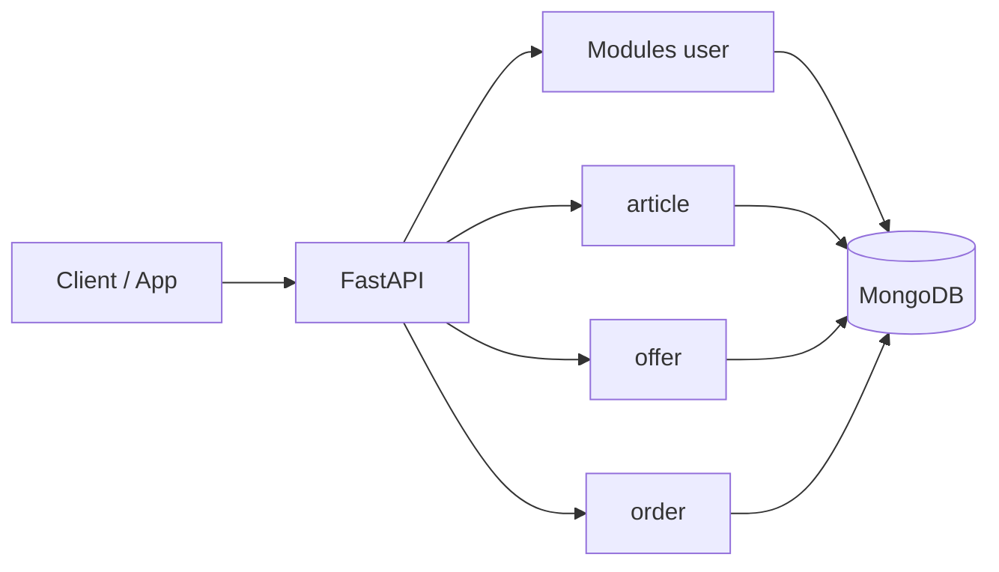

# Architecture

## Vue d’ensemble

L’application est une API REST **stateless** (sauf session côté client via JWT). La persistance est entièrement dans **MongoDB**. Les règles métier vivent dans les **services** ; les **routers** FastAPI valident les entrées/sorties et appellent les services.

## Couches

| Couche | Rôle |
|--------|------|
| `app/main.py` | Création de l’app, CORS, lifespan MongoDB, montage des routers |
| `app/core/` | Configuration (`config.py`), sécurité JWT, connexion Motor |
| `app/modules/*/` | Par domaine : `model.py`, `service.py`, `router.py` |
| `app/dependencies.py` | Dépendances FastAPI (ex. utilisateur courant) |

## Modules métier

| Module | Préfixe / tags | Rôle |
|--------|----------------|------|
| **user** | `/auth` | Inscription, login, profil JWT |
| **article** | `/articles` | CRUD annonces |
| **offer** | `/offers` | Offres sur des articles (agrégations avec détail article) |
| **order** | `/orders` | Commandes (agrégations avec détail article) |

## Cycle de vie

Au **démarrage**, `lifespan` ouvre le client Motor et l’attache à `app.state` / `app.client`. Au **shutdown**, la connexion est fermée proprement.

## Santé

`GET /health` exécute un `ping` administrateur MongoDB et renvoie une erreur HTTP 500 si la base est injoignable.
