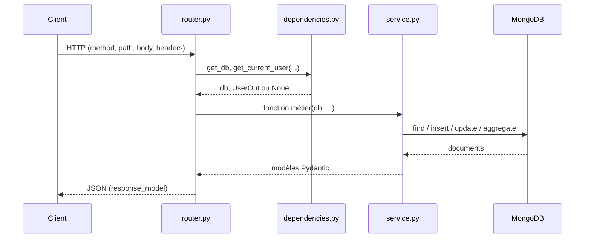
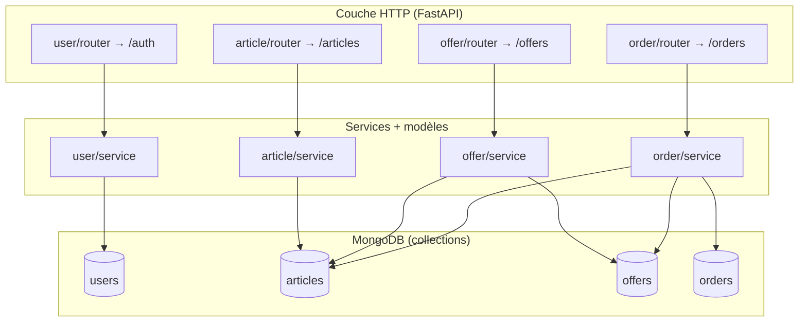

# Architecture

Ce document explique **comment le code est organisé** et **ce qui se passe quand une requête HTTP arrive**, pour que tu puisses naviguer dans le dépôt sans deviner.

## Métier en une phrase

C’est une **API de petite annonce** : un **article** est une annonce ; un acheteur peut faire une **offre** ; une **commande** matérialise l’achat (direct ou après offre acceptée). Tout est stocké dans **MongoDB** ; l’API ne garde **pas de session serveur** : l’identité du client vient du **JWT** dans le header `Authorization: Bearer …`.

## D’où tu entres dans le code

1. Ouvre **`app/main.py`** : c’est le point d’entrée (app FastAPI, CORS, branchement des routers, `/health`).
2. Pour une route précise (ex. liste d’articles), va dans **`app/modules/<domaine>/router.py`** : tu y vois l’URL, les query params et les `Depends`.
3. La logique métier et l’accès Mongo sont dans **`app/modules/<domaine>/service.py`**.
4. Les schémas JSON (entrée/sortie) sont dans **`app/modules/<domaine>/model.py`** (Pydantic).

Les dossiers **`app/core/`** (config, JWT, connexion Mongo) et **`app/dependencies.py`** (injection `get_db`, `get_current_user`) sont partagés par tous les modules.

## Flux d’une requête (étape par étape)

Exemple : **`GET /articles`** (liste publique, sans login obligatoire).

1. **FastAPI** reçoit la requête et appelle la fonction handler déclarée dans `article/router.py`.
2. Avant le handler, FastAPI résout les **`Depends`** :
   - **`get_db`** lit `request.app.db` (la base Mongo injectée au démarrage).
   - **`get_current_user_optional`** lit le JWT s’il est présent ; sinon l’utilisateur reste `None`.
3. Le **router** appelle une fonction **`async`** du **service**, en passant surtout `db` et les paramètres HTTP déjà typés.
4. Le **service** exécute des requêtes **Motor** (`find`, `insert_one`, `update_one`, parfois `aggregate`) sur les **collections** Mongo.
5. Les documents renvoyés sont convertis en **modèles Pydantic** (`ArticleOut`, etc.) puis sérialisés en **JSON** par FastAPI.

En résumé : **Router = HTTP + validation des params / corps** ; **Service = règles + Mongo** ; **Model = forme des données**.

## Schéma des modules et de la base

Les routes métier sont découpées en **quatre modules** sous `app/modules/`. Chaque module parle à une ou plusieurs **collections** nommées explicitement dans le code.

**Pourquoi offres et commandes pointent aussi vers `articles` ?**  
Les réponses API peuvent inclure un **aperçu d’article** (titre, image, prix…) sans appel séparé. C’est fait côté Mongo avec des **agrégations** (`$lookup`) ; les étapes réutilisables sont regroupées dans **`app/modules/article/aggregation.py`**.

## Tableau récapitulatif

| Élément | Rôle concret |
|--------|----------------|
| **`app/main.py`** | Crée l’app, enregistre le **lifespan** Mongo, monte les routers, expose `/health`. |
| **`app/core/database.py`** | Au démarrage : `AsyncIOMotorClient` + `app.db = client[settings.MONGODB_DB]`. À l’arrêt : fermeture du client. |
| **`app/core/config.py`** | Variables d’environnement (URI Mongo, nom de base, JWT…). |
| **`app/core/security.py`** | Hash mot de passe, création / décodage JWT. |
| **`app/dependencies.py`** | **`get_db`** → base async ; **`get_current_user`** → JWT obligatoire ; **`get_current_user_optional`** → JWT si présent. |
| **`router.py`** | Définit les chemins, les codes HTTP, les `Depends`, appelle le service et traduit les exceptions métier en réponses HTTP si besoin. |
| **`service.py`** | Règles métier, accès collections, **pas** de détails HTTP (idéalement). |
| **`model.py`** | Schémas Pydantic : champs, validation, alias Mongo (`_id` → `id` via les modèles de base dans `app/core/custom_document.py`). |

## Cycle de vie du processus

Au **démarrage** du worker Uvicorn, le **`lifespan`** dans `main.py` appelle `start_up_mongodb` : si la connexion échoue, l’application ne démarre pas correctement.  
Pendant les requêtes, **`request.app.db`** est toujours la même base (une connexion client Motor partagée).  
Au **shutdown**, `shutdown_mongodb` ferme le client.

## Santé

**`GET /health`** envoie un **`ping`** administrateur à MongoDB. Si la base ne répond pas, l’API renvoie une erreur **500** avec le détail de l’exception : utile pour un load balancer ou un orchestrateur, pas pour exposer des détails en production sans filtre (à durcir si besoin).

## Fichiers utiles hors `modules/`

| Fichier / dossier | Usage |
|-------------------|--------|
| **`scripts/seed.py`** | Peupler la base avec des données de démo (voir doc Development). |
| **`tests/`** | Tests pytest ; la structure suit `pytest.ini` (`unit` / `functional`). |

---

**En pratique** : pour modifier un comportement métier, commence par **`service.py`** du module concerné ; pour changer l’URL, les query params ou l’auth sur une route, **`router.py`**.
