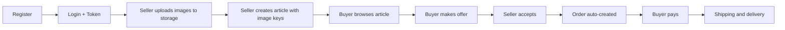

# Parcours metier (stakeholder)

Cette page explique le fonctionnement de la plateforme comme une **histoire produit**.
Le but est de rendre le process lisible pour un public non technique tout en gardant les endpoints utiles.

## Objectif business

Permettre a un vendeur de publier un article, a un acheteur de proposer un prix (ou acheter directement),
puis de finaliser la transaction avec suivi de commande.

## Les 2 acteurs

- **Vendeur**: publie des articles, accepte/refuse les offres, met a jour le statut de commande.
- **Acheteur**: consulte les annonces, fait une offre, paie et suit sa commande.

## Regle d'acces (simple)

- Les actions publiques (ex: consulter des articles) ne demandent pas de token.
- Les actions metier (creer, modifier, payer, accepter/refuser) demandent:
  `Authorization: Bearer <access_token>`.

## Process principal (offre puis commande)

### 1) Creer un compte

- Endpoint: `POST /auth/register`
- Resultat attendu: utilisateur cree
- Exemple d'intention: "Je veux rejoindre la marketplace"

Exemple de body:

```json
{
  "email": "buyer@example.com",
  "password": "StrongPassword123",
  "full_name": "Buyer User"
}
```

### 2) Se connecter et recuperer un token

- Endpoint: `POST /auth/login`
- Resultat attendu: `access_token` + type de token
- Impact produit: la session applicative est "ouverte" pour les actions privees

Exemple de body:

```json
{
  "email": "buyer@example.com",
  "password": "StrongPassword123"
}
```

### 3) Uploader les images dans le storage (vendeur)

- Endpoint: `POST /storage/upload`
- Auth: token vendeur obligatoire
- Resultat attendu: une `key` de fichier par image (ex: `f81d..._iphone12.jpg`)
- Impact produit: les images sont stockees dans R2 et pourront etre resolues en URL signee.

Exemple de reponse:

```json
{
  "key": "f81d4fae7dec11d0a76500a0c91e6bf6_iphone12.jpg"
}
```

### 4) Publier un article (vendeur)

- Endpoint: `POST /articles`
- Auth: token vendeur obligatoire
- Resultat attendu: annonce creee avec un `article_id`
- Impact produit: l'article apparait dans le catalogue
- Regle metier: le champ `images` doit contenir les `key` retournees par `/storage/upload`
  (pas les binaries).

Exemple de body:

```json
{
  "title": "iPhone 12 128Go",
  "description": "Bon etat, batterie 86%",
  "price": 450,
  "images": [
    "f81d4fae7dec11d0a76500a0c91e6bf6_iphone12.jpg",
    "3c2f8f1be5b64c0a9f52a9b1d2f8c1aa_back.jpg"
  ]
}
```

### 5) Consulter le catalogue (acheteur)

- Endpoints:
  - `GET /articles` (liste)
  - `GET /articles/{article_id}` (detail)
- Impact produit: l'acheteur choisit une annonce interessante

### 6) Faire une offre (acheteur)

- Endpoint: `POST /offers`
- Auth: token acheteur obligatoire
- Resultat attendu: offre creee avec `offer_id`
- Impact produit: le vendeur recoit une proposition de prix

Exemple de body:

```json
{
  "article_id": "<article_id>",
  "amount": 420
}
```

### 7) Reponse du vendeur sur l'offre

- Accepter: `PUT /offers/{offer_id}/accept`
- Refuser: `PUT /offers/{offer_id}/decline`

Effet metier:

- **Si acceptee**: une commande est creee automatiquement.
- **Si refusee**: l'offre est cloturee et le process s'arrete pour cette offre.

### 8) Paiement (acheteur)

- Endpoint: `POST /orders/{order_id}/pay`
- Auth: token acheteur obligatoire
- Resultat attendu: commande passe a l'etat "paye"
- Impact produit: la vente est engagee

### 9) Suivi de commande (vendeur/acheteur)

- Changer l'etat: `PUT /orders/{order_id}/status`
- Lister ses commandes: `GET /orders/mine?role=buyer|seller`
- Voir une commande: `GET /orders/{order_id}`

Statuts typiques de progression:

- `pending` -> `paid` -> `shipped` -> `delivered`
- cas alternatifs: `cancelled`, `disputed`

## Scenario alternatif: achat direct (sans offre)

Si l'acheteur ne souhaite pas negocier:

- Endpoint: `POST /orders/direct`
- Body: `article_id`
- Effet: creation immediate d'une commande, puis paiement et suivi comme le scenario principal.

## Vue visuelle rapide



## A doit retenir

- Le parcours est court et lisible: **inscription -> upload image -> publication -> offre/achat -> paiement -> livraison**.
- Le token sert uniquement a securiser les actions importantes.
- Le modele couvre les 2 usages metier: **negociation** (offres) et **achat direct**.
- Les images transitent par le module storage; les routes article exposent ensuite des URLs pretes a consommer.
